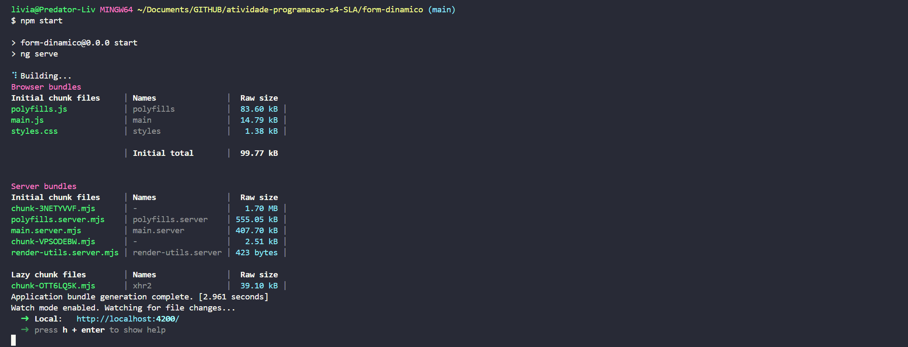
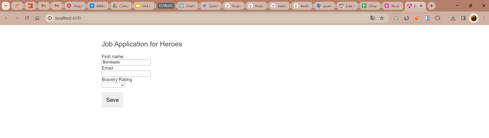
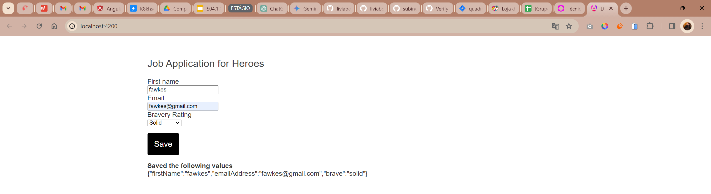
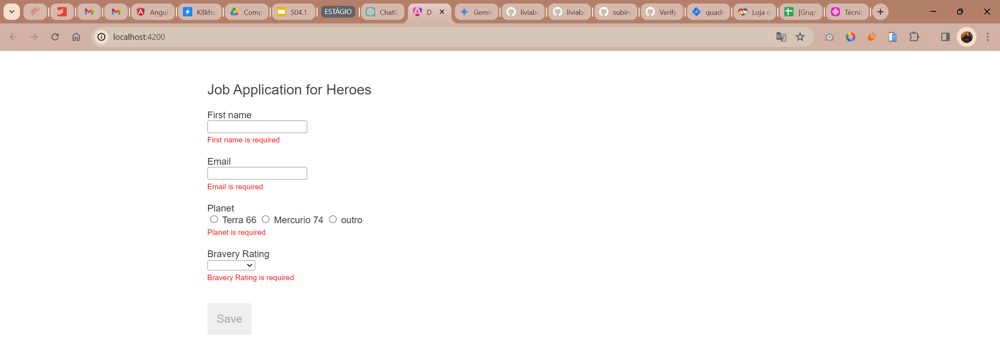
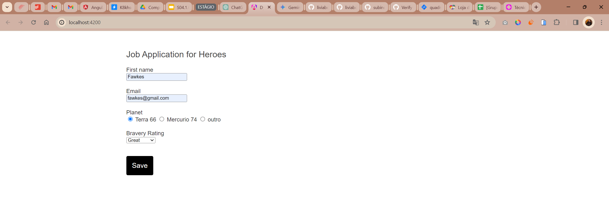
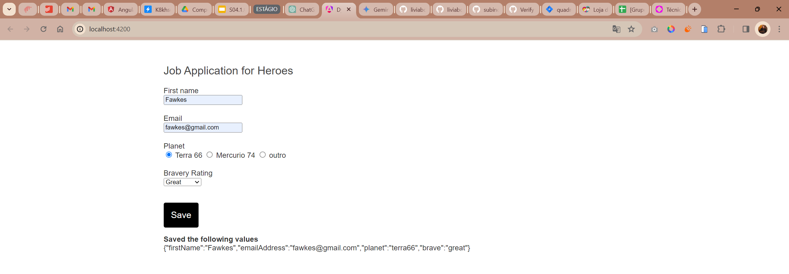

# Relatório: construção de formulários dinâmicos com angular
O relatório aborda a construção de um formulário web dinâmico usando Angular, trazendo a criação de um sistema flexível e reutilizável para formulários que exigem atualizações frequentes sem necessidade de alterações substanciais no código.

Baseado no tutorial: https://angular.io/guide/dynamic-form

## Tecnologia e conceitos aprendidos

##### Angular e formulários reativos:
- **Angular + SPA**: framework para construção de aplicações web, unido à conceitos de single page application (SPA). O Angular é um framework ideal para o desenvolvimento de SPAs devido à sua arquitetura baseada em componentes, serviços reativos e gerenciamento eficiente do estado da aplicação. Ao construir formulários dinâmicos em Angular, aproveitamos essas mesmas vantagens para criar interfaces de usuário reativas que respondem às ações do usuário de maneira eficiente, integrando-se perfeitamente ao modelo SPA.
- **Formulários reativos**: abordagem para criação de formulários de forma programática, oferecendo controle detalhado sobre a lógica de formulários e mudanças de estado. Assim como os SPAs atualizam o conteúdo da página dinamicamente sem recarregar a página inteira, os formulários dinâmicos alteram os campos do formulário com base nas interações do usuário ou em alterações no modelo de dados, sem a necessidade de navegar para uma nova página ou recarregar a página atual. 
- **Melhor experiência do usuário e performance**: sem recargas de página, a interação com o formulário é mais fluida e natural, pois apenas as partes modificadas do formulário são carregadas, reduzindo o consumo de dados e o tempo de carregamento. Além disso, as atualizações no formulário são instantâneas, proporcionando uma resposta rápida às ações do usuário. 
- **Modelagem de dados para formulários**: construção de um modelo de dados robusto que descreve os controles do formulário, incluindo tipos de controle, validações, etiquetas, e outras propriedades necessárias.
- **Serviços Angular**: uso de serviços para encapsular lógicas de negócios específicas e fornecer funcionalidades para componentes, crucial para gerar grupos de controles de formulário e fornecer dados de perguntas.
- **Componentes dinâmicos**: criação de componentes que renderizam diferentes tipos de perguntas baseadas em dados do modelo, permitindo a criação de formulários flexíveis.

## Resumo dos passos executados

1. Importação do `ReactiveFormsModule` para uso de formulários reativos.

2. Criação de classes para representar diferentes tipos de perguntas (como `TextboxQuestion` e `DropdownQuestion`).

3. Uso de um serviço (`QuestionService`) para fornecer um conjunto de perguntas.

4. Criação de um componente (`DynamicFormComponent`) que gera controles de formulário dinamicamente.

5. **Extras (aprimoramento da versão do tutorial):** implementação de uma nova pergunta por radio button, validação de resposta preenchida (required) e estilização para melhorar a experiência do usuário.

## Capturas de tela

#### Executando o código:

#### Formulário vazio - versão do tutorial:

#### Formulário preenchido e valores salvos - versão do tutorial:

### Extras (aprimoramento da versão do tutorial):
#### Campos requeridos preenchimento, bom botão submit inativo

#### Formulário preenchido

#### Valores salvos

## Instruções de execução
### FormDinamico

This project was generated with [Angular CLI](https://github.com/angular/angular-cli) version 17.2.2.

#### Development server

Run `ng serve` for a dev server. Navigate to `http://localhost:4200/`. The application will automatically reload if you change any of the source files.

#### Code scaffolding

Run `ng generate component component-name` to generate a new component. You can also use `ng generate directive|pipe|service|class|guard|interface|enum|module`.

#### Build

Run `ng build` to build the project. The build artifacts will be stored in the `dist/` directory.

#### Running unit tests

Run `ng test` to execute the unit tests via [Karma](https://karma-runner.github.io).

#### Running end-to-end tests

Run `ng e2e` to execute the end-to-end tests via a platform of your choice. To use this command, you need to first add a package that implements end-to-end testing capabilities.

#### Further help

To get more help on the Angular CLI use `ng help` or go check out the [Angular CLI Overview and Command Reference](https://angular.io/cli) page.
